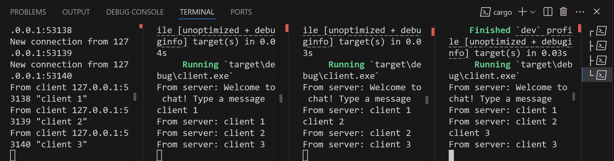

# Module 10 Reflection
## Malvin Muhammad Raqin - 2306275821

**Single Server, Multiple Client Architecture**

This implementation showcases a standard broadcast messaging system. Upon connection, each client receives a greeting from the server. When a client transmits a message, the server captures it, records the activity, and relays it to every connected client (including the original sender). The server utilizes Tokio's broadcast channel mechanism to distribute messages across all clients, which explains why each message displays with a "From server:" label on every client terminal. All clients receive all messages since the server forwards each incoming message to the entire client pool, effectively creating a basic group messaging system where participants can view all conversations.