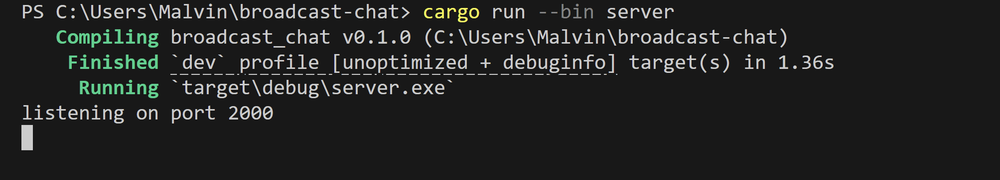

# Module 10 Reflection
## Malvin Muhammad Raqin - 2306275821

**Single Server, Multiple Client Architecture**

This implementation showcases a standard broadcast messaging system. Upon connection, each client receives a greeting from the server. When a client transmits a message, the server captures it, records the activity, and relays it to every connected client (including the original sender). The server utilizes Tokio's broadcast channel mechanism to distribute messages across all clients, which explains why each message displays with a "From server:" label on every client terminal. All clients receive all messages since the server forwards each incoming message to the entire client pool, effectively creating a basic group messaging system where participants can view all conversations.

**2. Port Configuration Testing**
**Scenario 1: Server on Port 2000, Clients on Port 8080**

**Scenario 2: Both Using Port 8080**

In the first scenario, client connections were unsuccessful due to a port mismatch - clients attempted to connect to port 8080 while the server was actively listening on port 2000. Successful network communication depends on both parties using identical port numbers for connection establishment. In the second scenario, when the server and all clients were set to port 8080, connections were established successfully since all components were communicating through the same network port. This demonstrates the essential networking rule that servers must listen on the precise port number that clients are targeting for connection attempts.